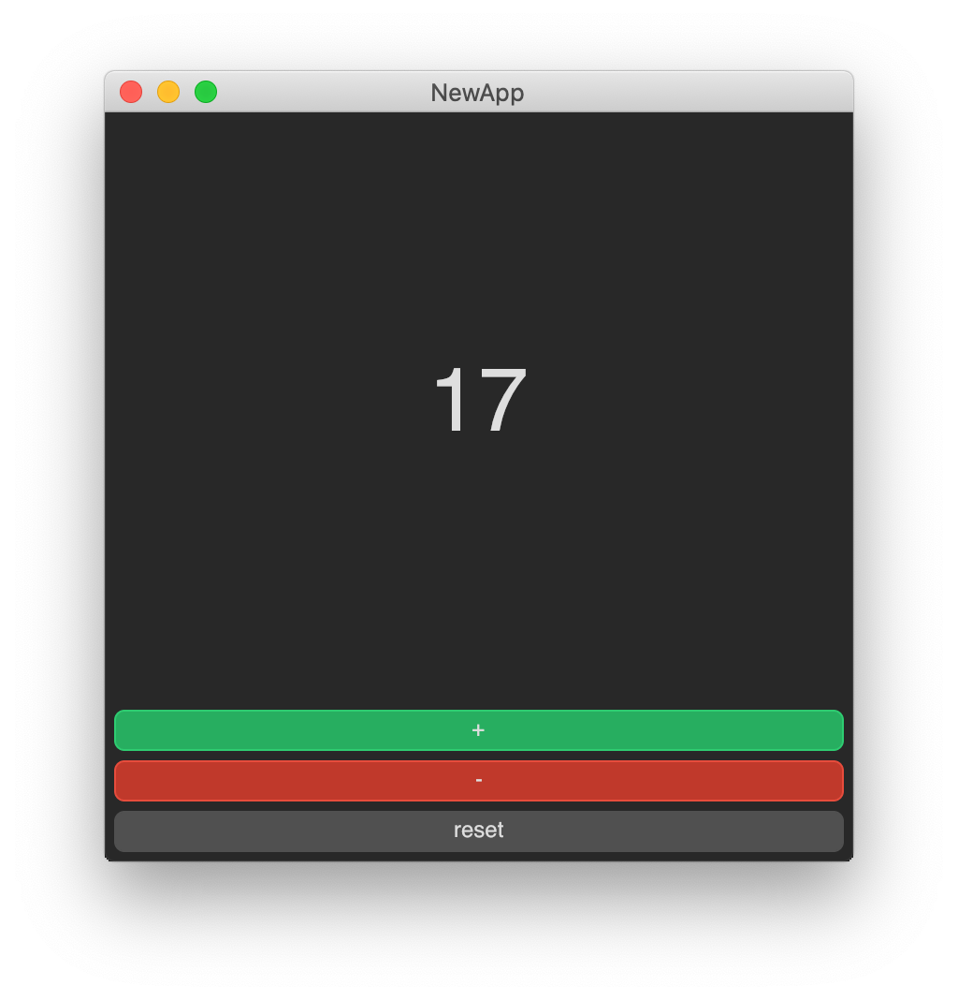

# Avalonia FuncUI ProjectTemplates

This repository contains .NET Project templates for FuncUI. 

## Install (Current Beta Package)

```
dotnet new --install JaggerJo.Avalonia.FuncUI.Templates
```

## Create an App

**Create a new basic App** (only contains a simple elmish view)

```
dotnet new funcui.basic -n NewApp
```

**Create a new full App** (contains a Style.xaml file and other extras.)

```
dotnet new funcui.full -n NewApp
```

## Run the App

```
dotnet run NewApp
```


